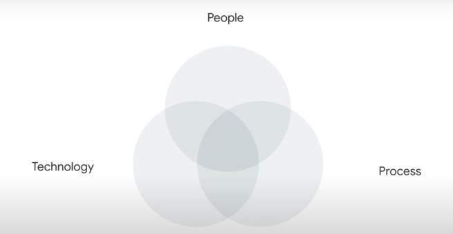
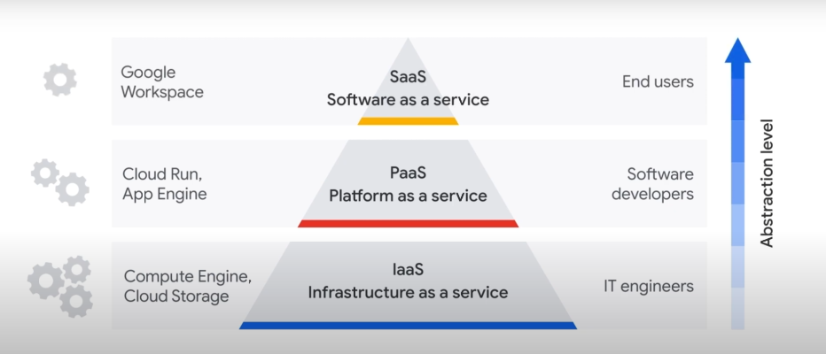
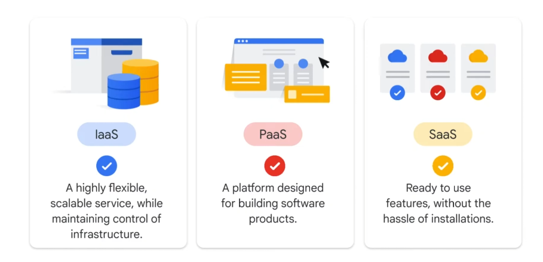
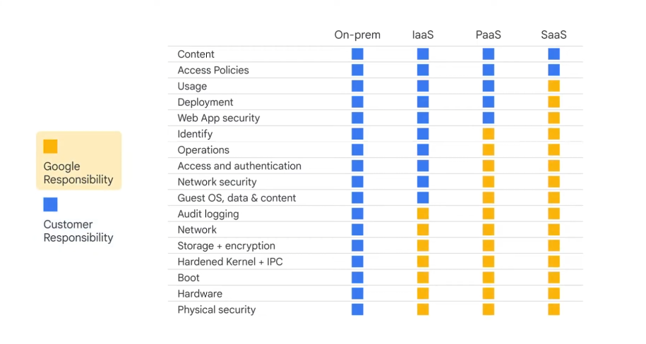

# Digital Transformation with Google Cloud

# Why cloud technology is transforming business

Nuvem está transformando como as empresas desenvolvem prosutos e criam seu valor. Isso muda como interagimos com o mundo, como interagimos como mídia, como diagnosticamos doenças etc.

### Quais as chaves para a transformação em nuvem:

#### Definição de transformação digial:

Quando uma organização usa novas tecnologias digitais, como plataforma de nuvens públicas, privadas ou híbridas para CRIAR ou MODIFICAR processos, culturas e experiência dos clientes COM O INTUITO de atender às necessidades de negócios e dinâmicas de mercado.

## What is the cloud?

Cloud é uma metáfora conceitual usada para representar a ideia de que os serviços oferecidos não estão armazenados localmente, mas são acessados em servidores remotos via internet.

### Maneiras que uma empresa pode organizar sua IT:

#### On-premises:
- localmente hospodadas
- opera em um data center organizacional local
- é a maneira tradicional de se gerenciar insfraestrutura de TI
- não requer autorização de terceiros
- propietários tem controle físico sobre o data center
- não é necessário assinatura recorrente do serviço 

contras:
- requer espaço físico
- requer condições físicas (temperatura e eletricidade) específicas para seu funcionamento
- requer um profissional qualificado
- difícil de escalar

### Clouds:

#### Private Cloud:

- dedicada a uma organização, não para o público em geral
- conhecida por 'single-tenant' (inquilino único) ou corporate cloud

- geralmente empresas optam pela nuvem privada quando já fizeram um grande investimento em servidores e/ou precisam que suas informações se mantenham privadas.

#### Public Cloud:

- multi-tenant cloud infrastructure
- funciona como um prédio: cada empresa (ou inquilino) aluga um apartamento (que podem variar em tamnho ou utilidades) mas que representam um espaço privado do prédio público.

### Tipos de nuvens:

#### IaaS:
Infrastucture as a service

#### Paas:
Plataform as a service

#### Saas:
Service as a service

## Benefits if cloud computing:

- escalabilidade
- fexibilidade: empresas podem acessar de qualquer lugar
- ágil: empresas podem produzir novas tecnologias sem se preocupar com infraestrutura
- valor estratégico: vantagem competititva, maior retorno de investimento, aplicação de novas tecnologias com rapidez
- segurança: mais forte que segurança local e privada, times dedicados 
- custo-benefício: só paga o serviço usado

## Real world examples:

### Nintendo:

Iniciou como uma empresa que vendia jogos de tabuleiros e evoluiu de acordo com o surgimento das novas tecnologias. Enquanto seus concorrentes faliam, Nintendo evoluía, mudando o escopo dos seus produtos. Nintendo usa a tecnologia Google Clouds.

## Cloud Eras:

VM Cloud Era ---> Infrastructure cloud era ---> Tranformation cloud

## Challenges that lead to a digital transformation:

- melhorar o entendimento sobre o uso de dados e BI
- melhorar a tecnologia de infraestrutura
- melhorar o ambiente de trabalho híbrido
- saber que os dados, sistemas e usuários da empresa estão seguros
- priorizar sustentabilidade

## Google's tranformation Cloud:

### chaves principais:

#### Data:

É a chave para extrair informções com IA. 
Para se tornar uma empresa baseada em dados é um caminho não tão fácil. Apenas 26% das empresas conseguiram fazer a transição de maneira satisfatória.
uma Data Cloud acelera o processo de forma segura e com eficiência.

#### Open infrastructure:

Facilita inovação, reduz o aprisionamento à apenas um provedor nuvem e oferece flexibilidade para construir, migrar e gerenciar aplicações.

#### Collaboration:

Colaboração entre empresas e empregados são fundamentais para a um avanço transparente e funcional. Na Google, por exemplo, a coleboração está presente no Google Workspace

#### Trust:

Uma cloud confiável ajuda as empresas a se sentirem seguras com os dados armazenados na nuvem. 

#### Sustainable Technology:

Cloud ajuda a poupar emissões de carbono, poupando infraestrutura local. 

## The Google Cloud Adoption Framework:

Como organizações podem iniciar o processo de migração para o framwork Google Cloud?

São os três principais pilares:

Cloud Maturity Assessment - criação de um plano para migração que mostra onde a organização está e onde quer chegar

O Google Cloud Adoption Framework é um conjunto de tarefas factíveis que organizações precisam instituir para adotar a utilização da nuvem.

Passo 01: cloud maturity - verificar onde a empresa de encontra
Passo 02: determinação de um plano de ação usando o frmawork

# Fundamental Cloud Concepts:

## Total Cost of Ownership:

É um cálculo realizado pela organização para comparar o custo da adoção do framework Google Cloud com o custo do sistema próprio.

Apesar de parecer um cálculo óbvio, comumente erros são cometidos ao realizar a comparação:
- o maior custo de sistemas on-premises é o custo inicial de implantação com os equipamentos. Além disso, deve-se considerar o custo de manutenção de sistemas locais.
- enquanto isso o custo do sistema cloud deve ser contabilizado pelas assinaturas e crescimento por projeto adotado.

## Capital expenditures x operating expanses:

Mudar o sistema para a nuvem muda, também, a maneira com que a organização lida com os gastos e investimento. 

- Capital expenditures: empresas que usam on-premises calculam os gastos anualmente (geralmente) e contabilizam de acordo com o aporte que fazem para crescimento interno (como compra de servidores, esquipamentos periféricos etc). Por isso precisam de um capital inicial significativo e, caso precisem expandir seu negócio, é um investimento que pode não fazer sentido inicialmente pelo valor dos equipamentos comprados.

- Operating Expenses: já empresas que usam os serviços da nuvem solicitam os serviços de acordo com a necessidade. Dessa forma uma empresa pequena não precisa de um aporte inicial muito grande e que pode comprometer seu funcionamento. Com essa mudança de paradigma, a maneira com que as organizações lidam com os gastos também deve mudar: ao invés de calcular os gastos em grandes períodos de tempo, o gasto deve ser acompanhado sistematicamente, considerando que é bastante variável (de acordo com o uso do serviço da nuvem).

## Private cloud, Hybrid cloud e multi-cloud strategies:

### Private cloud: 
São empresas que virtualizaram seu próprio data center ou que solicitam os serviços de um provedor em nuvem privado para desenvolver um ambiente dedicado privado.
- geralmente são adotados quando uma empresa já realizou aportes significativos de equipamento para data center ou precisam manter dados privados por motivos legais

### Hybrid cloud:
Combinam tipos de serviços diferentes, como nuvem privadas e publicas simultaneamente.
É o modelo mais comum de arquitetura de dados.

### Multi Cloud:
Combinam duas ou mais servidores de nuvem públicas.
Uma organização pode escolher esse modelo para tirar proveito das vantagens de cada servidor.

## How a network supports digital transformation:

### Bandalarga:
é a medida de quanto dado pode ser transferido em um determinado período de tempo. Anlaogicamente, é a quantiadde de água que pode ser transportada por um cano: quanto mais largo, mais água.

### Latência:
é o tempo que o dado leva para ser transportado de A para B.

# Cloud Computing Models and Shared Responsibility:

## Cloud computing service models:

Quanto mais alto, menos é o nível de abstração necessário para utilizar o serviço da nuvem.

Analogamente: On-premises é como ter um carro próprio: você é responsável pela manutenção, direção e guia; IaaS é como alugar um carro: você deve saber dirigir e saber para onde quer ir; PaaS é como pegar um taxi: o motorista dirige para você, mas atende a solicitação do seu direcionamento; SaaS é como pegar um ônibus: as rotas são pré definidas e você divie o espaço com outras pessoas

### Iaas:

benefícios:
- econômico: só paga o que usa
- eficiente
- aumenta a produtividade
- confiável
- escalável 

### PaaS:

Plataforma que oferece um ambiente de desenvolvimento de softwares e aplicações sem a necessidade de criar ou manter uma insfraestrutura base. 

benefícios:
- reduz tempo de desenvolvimento
- escalável
- reduz gerenciamento
- flexível

### Saas:

Modelo computacional que oferece aplicações de maneira remota através do browser de internet, sem a necessidade de baixar ou instalar nada.

benefícios:
- baixa manutenção
- fexível

## Choosing a cloud computing model:

Considerando a pirâmide acima, cada nível de nuvem tem em si um nível de expertise e tempo de manutenção necessário. A maior quantidade de energia necessária para manter a aplicação, maior a flexibilidade e adaptabilidade que a plataforma vai oferecer.

## Responsibility model:

Níveis de responsabilidade de acordo com o serviço prestado:

